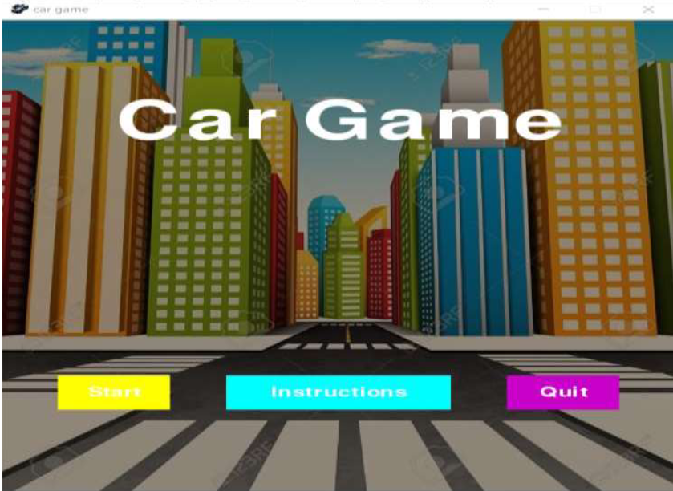
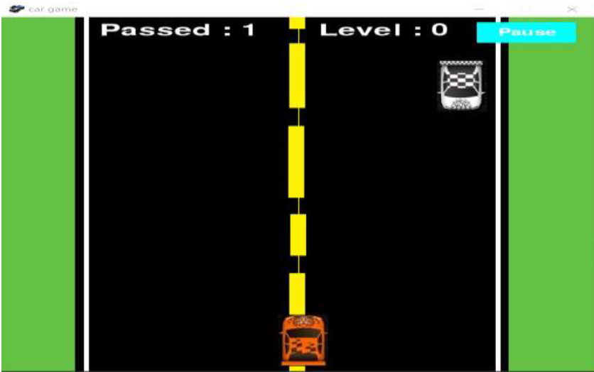
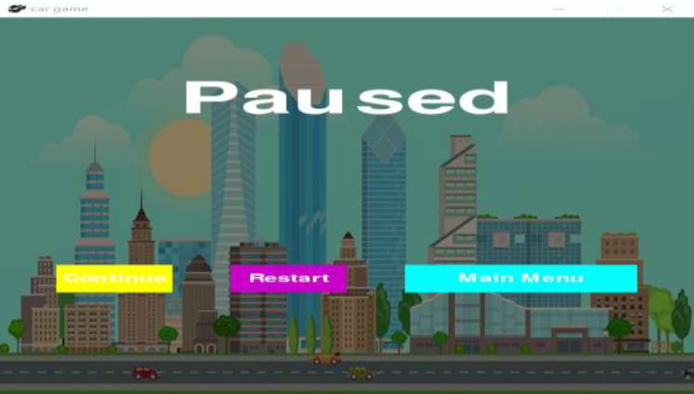
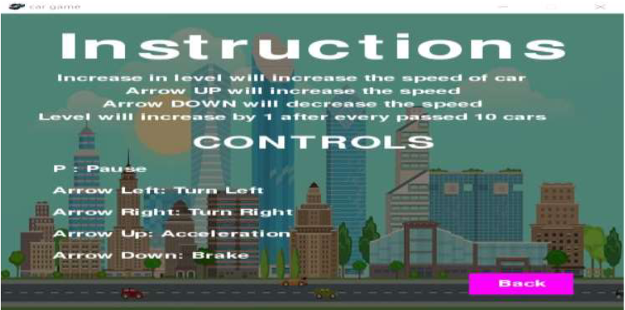

# Car-Game-OpenCV
Computer vision based car game using OpenCV. 

Python is import programming language, it is very easy to implement the code in python. The car game is implemented using pygame, random and opencv python libraries. In this game you have to dodge the coming cars, so that your score will increase. Try to get maximum score by dodging as many cars are possible. Using head rotation the car will accelerate or apply brakes. The level will increase continuously as you dodge 10 cars. After increase in level the game speed will also increase.

With the help of OpenCV head rotation is calculated, if user is looking left side car will also move towards its left. Same goes for right side. If user wants to accelerate user should look upwards and to apply brakes user should look downwards.

The instructions page displays all the necessary instructions useful to play the game. Three buttons are also displayed to play, show instructions and quit the game.

